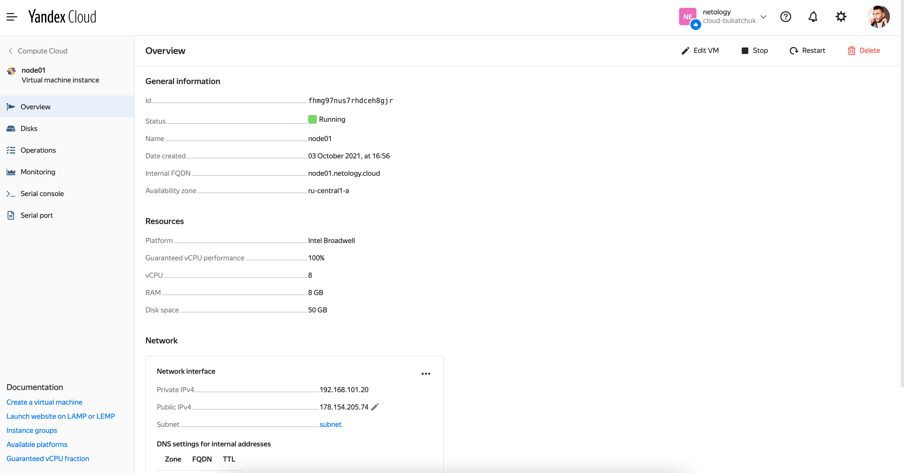
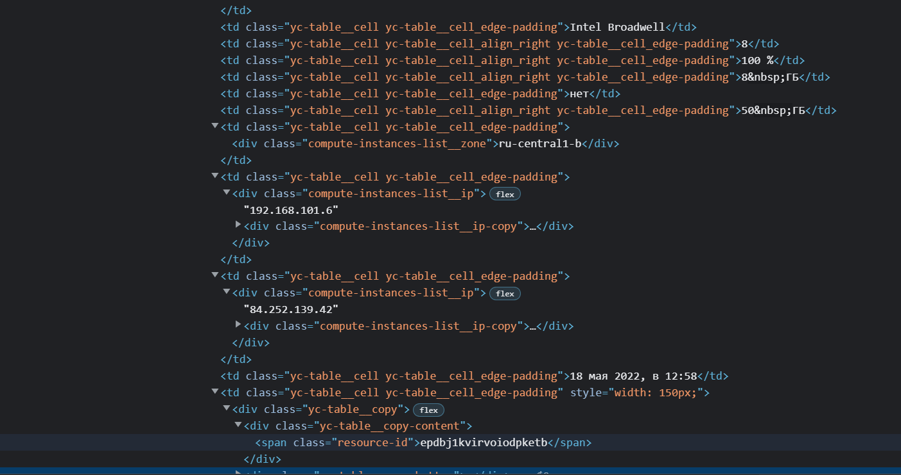

# Домашнее задание к занятию "5.4. Оркестрация группой Docker контейнеров на примере Docker Compose"

## Как сдавать задания

Обязательными к выполнению являются задачи без указания звездочки. Их выполнение необходимо для получения зачета и диплома о профессиональной переподготовке.

Задачи со звездочкой (*) являются дополнительными задачами и/или задачами повышенной сложности. Они не являются обязательными к выполнению, но помогут вам глубже понять тему.

Домашнее задание выполните в файле readme.md в github репозитории. В личном кабинете отправьте на проверку ссылку на .md-файл в вашем репозитории.

Любые вопросы по решению задач задавайте в чате учебной группы.

---

## Задача 1

Создать собственный образ операционной системы с помощью Packer.

Для получения зачета, вам необходимо предоставить:
- Скриншот страницы, как на слайде из презентации (слайд 37).

```bash

root@dev1-10:~/yc/src/ansible# ansible-playbook provision.yml 

PLAY [nodes] *******************************************************************************************************************************************************
TASK [Gathering Facts] *********************************************************************************************************************************************ok: [node01.netology.cloud]

TASK [Create directory for ssh-keys] *******************************************************************************************************************************ok: [node01.netology.cloud]

TASK [Adding rsa-key in /root/.ssh/authorized_keys] ****************************************************************************************************************changed: [node01.netology.cloud]

TASK [Checking DNS] ************************************************************************************************************************************************changed: [node01.netology.cloud]

TASK [Installing tools] ********************************************************************************************************************************************changed: [node01.netology.cloud] => (item=['git', 'curl', 'vim'])

TASK [Add docker repository] ***************************************************************************************************************************************changed: [node01.netology.cloud]

TASK [Installing docker package] ***********************************************************************************************************************************changed: [node01.netology.cloud] => (item=['docker-ce', 'docker-ce-cli', 'containerd.io'])

TASK [Enable docker daemon] ****************************************************************************************************************************************changed: [node01.netology.cloud]

TASK [Install docker-compose] **************************************************************************************************************************************changed: [node01.netology.cloud]

TASK [Synchronization] *********************************************************************************************************************************************changed: [node01.netology.cloud]

TASK [Pull all images in compose] **********************************************************************************************************************************changed: [node01.netology.cloud]

TASK [Up all services in compose] **********************************************************************************************************************************changed: [node01.netology.cloud]

TASK [Installing ctop] *********************************************************************************************************************************************fatal: [node01.netology.cloud]: FAILED! => {"changed": true, "msg": "non-zero return code", "rc": 3, "stderr": "Shared connection to 84.252.139.42 closed.\r\n", "stderr_lines": ["Shared connection to 84.252.139.42 closed."], "stdout": "  % Total    % Received % Xferd  Average Speed   Time    Time     Time  Current\r\n                                 Dload  Upload   Total   Spent    Left  Speed\r\n\r  0     0    0     0    0     0      0      0 --:--:-- --:--:-- --:--:--     0\r  0     0    0     0    0     0      0      0 --:--:-- --:--:-- --:--:--     0\r  0     0    0     0    0     0      0      0 --:--:-- --:--:-- --:--:--     0\r\n\r 30 12.9M   30 4112k    0     0  3248k      0  0:00:04  0:00:01  0:00:03 3248k\r100 12.9M  100 12.9M    0     0  8770k      0  0:00:01  0:00:01 --:--:-- 35.9M\r\ncurl: (3) <url> malformed\r\n", "stdout_lines": ["  % Total    % Received % Xferd  Average Speed   Time    Time     Time  Current", "                                 Dload  Upload   Total   Spent    Left  Speed", "", "  0     0    0     0    0     0      0      0 --:--:-- --:--:-- --:--:--     0", "  0     0    0     0    0     0      0      0 --:--:-- --:--:-- --:--:--     0", "  0     0    0     0    0     0      0      0 --:--:-- --:--:-- --:--:--     0", "", " 30 12.9M   30 4112k    0     0  3248k      0  0:00:04  0:00:01  0:00:03 3248k", "100 12.9M  100 12.9M    0     0  8770k      0  0:00:01  0:00:01 --:--:-- 35.9M", "curl: (3) <url> malformed"]}

PLAY RECAP *********************************************************************************************************************************************************node01.netology.cloud      : ok=12   changed=10   unreachable=0    failed=1    skipped=0    rescued=0    ignored=0   

```

> Доделал установку ctop из pplaybook

```bash

root@dev1-10:~/yc/src/ansible# ansible-playbook --step provision.yml 

PLAY [nodes] *******************************************************************************************************************************************************Perform task: TASK: Gathering Facts (N)o/(y)es/(c)ontinue: n

Perform task: TASK: Gathering Facts (N)o/(y)es/(c)ontinue: *********************************************************************************************************Perform task: TASK: Create directory for ssh-keys (N)o/(y)es/(c)ontinue: n

Perform task: TASK: Create directory for ssh-keys (N)o/(y)es/(c)ontinue: *******************************************************************************************Perform task: TASK: Adding rsa-key in /root/.ssh/authorized_keys (N)o/(y)es/(c)ontinue: n

Perform task: TASK: Adding rsa-key in /root/.ssh/authorized_keys (N)o/(y)es/(c)ontinue: ****************************************************************************Perform task: TASK: Checking DNS (N)o/(y)es/(c)ontinue: n

Perform task: TASK: Checking DNS (N)o/(y)es/(c)ontinue: ************************************************************************************************************Perform task: TASK: Installing tools (N)o/(y)es/(c)ontinue: n

Perform task: TASK: Installing tools (N)o/(y)es/(c)ontinue: ********************************************************************************************************Perform task: TASK: Add docker repository (N)o/(y)es/(c)ontinue: n

Perform task: TASK: Add docker repository (N)o/(y)es/(c)ontinue: ***************************************************************************************************Perform task: TASK: Installing docker package (N)o/(y)es/(c)ontinue: n

Perform task: TASK: Installing docker package (N)o/(y)es/(c)ontinue: ***********************************************************************************************Perform task: TASK: Enable docker daemon (N)o/(y)es/(c)ontinue: n

Perform task: TASK: Enable docker daemon (N)o/(y)es/(c)ontinue: ****************************************************************************************************Perform task: TASK: Install docker-compose (N)o/(y)es/(c)ontinue: n

Perform task: TASK: Install docker-compose (N)o/(y)es/(c)ontinue: **************************************************************************************************Perform task: TASK: Synchronization (N)o/(y)es/(c)ontinue: n

Perform task: TASK: Synchronization (N)o/(y)es/(c)ontinue: *********************************************************************************************************Perform task: TASK: Pull all images in compose (N)o/(y)es/(c)ontinue: n

Perform task: TASK: Pull all images in compose (N)o/(y)es/(c)ontinue: **********************************************************************************************Perform task: TASK: Up all services in compose (N)o/(y)es/(c)ontinue: n

Perform task: TASK: Up all services in compose (N)o/(y)es/(c)ontinue: **********************************************************************************************Perform task: TASK: Installing ctop (N)o/(y)es/(c)ontinue: y

Perform task: TASK: Installing ctop (N)o/(y)es/(c)ontinue: *********************************************************************************************************
TASK [Installing ctop] *********************************************************************************************************************************************changed: [node01.netology.cloud]

PLAY RECAP *********************************************************************************************************************************************************node01.netology.cloud      : ok=1    changed=1    unreachable=0    failed=0    skipped=0    rescued=0    ignored=0   


```


## Задача 2

Создать вашу первую виртуальную машину в Яндекс.Облаке.

Для получения зачета, вам необходимо предоставить:
- Скриншот страницы свойств созданной ВМ, как на примере ниже:

<p align="center">
  
</p>



## Задача 3

Создать ваш первый готовый к боевой эксплуатации компонент мониторинга, состоящий из стека микросервисов.

Для получения зачета, вам необходимо предоставить:
- Скриншот работающего веб-интерфейса Grafana с текущими метриками, как на примере ниже
<p align="center">
  
</p>


## Задача 4 (*)

Создать вторую ВМ и подключить её к мониторингу развёрнутому на первом сервере.


Для получения зачета, вам необходимо предоставить:
- Скриншот из Grafana, на котором будут отображаться метрики добавленного вами сервера.

