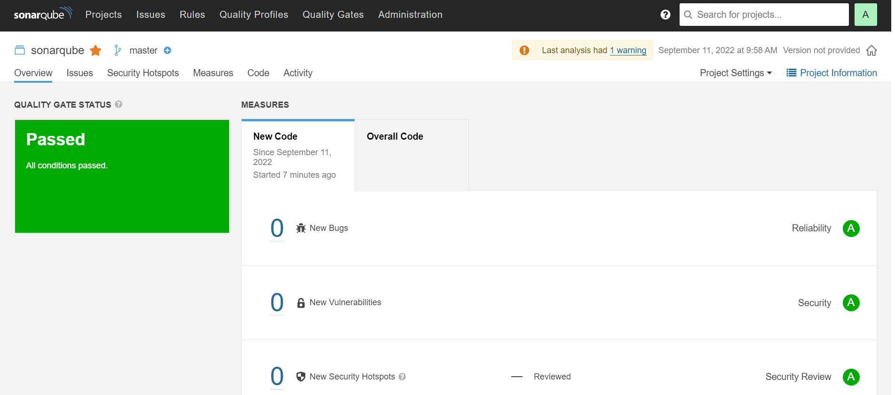

# Домашнее задание к занятию "09.02 CI\CD"

## Знакомоство с SonarQube

### Подготовка к выполнению

1. Выполняем `docker pull sonarqube:8.7-community`
2. Выполняем `docker run -d --name sonarqube -e SONAR_ES_BOOTSTRAP_CHECKS_DISABLE=true -p 9000:9000 sonarqube:8.7-community`
3. Ждём запуск, смотрим логи через `docker logs -f sonarqube`
4. Проверяем готовность сервиса через [браузер](http://localhost:9000)
5. Заходим под admin\admin, меняем пароль на свой

В целом, в [этой статье](https://docs.sonarqube.org/latest/setup/install-server/) описаны все варианты установки, включая и docker, но так как нам он нужен разово, то достаточно того набора действий, который я указал выше.

### Основная часть

1. Создаём новый проект, название произвольное
2. Скачиваем пакет sonar-scanner, который нам предлагает скачать сам sonarqube
3. Делаем так, чтобы binary был доступен через вызов в shell (или меняем переменную PATH или любой другой удобный вам способ)
4. Проверяем `sonar-scanner --version`

```bash

root@dev1-10:~/netol_do/devops-netology/ci_cd# sonar-scanner --version
INFO: Scanner configuration file: /root/netol_do/devops-netology/ci_cd/sonar-scanner-4.7.0.2747-linux/conf/sonar-scanner.properties
INFO: Project root configuration file: NONE
INFO: SonarScanner 4.7.0.2747
INFO: Java 11.0.14.1 Eclipse Adoptium (64-bit)
INFO: Linux 5.10.0-13-amd64 amd64
root@dev1-10:~/netol_do/devops-netology/ci_cd#

```

5. Запускаем анализатор против кода из директории [example](./example) с дополнительным ключом `-Dsonar.coverage.exclusions=fail.py`

```bash
root@dev1-10:~/netol_do/devops-netology/ci_cd/example# sonar-scanner \
  -Dsonar.projectKey=sonarqube \
  -Dsonar.sources=. \
  -Dsonar.host.url=http://192.168.1.117:9000 \
  -Dsonar.login=deaab7a3ea5b6a18a4ee7f04b237d7ec9be5490e \
> -Dsonar.coverage.exclusions=fail.py
INFO: Scanner configuration file: /root/netol_do/devops-netology/ci_cd/sonar-scanner-4.7.0.2747-linux/conf/sonar-scanner.properties
INFO: Project root configuration file: NONE
INFO: SonarScanner 4.7.0.2747
INFO: Java 11.0.14.1 Eclipse Adoptium (64-bit)
INFO: Linux 5.10.0-13-amd64 amd64
INFO: User cache: /root/.sonar/cache
INFO: Scanner configuration file: /root/netol_do/devops-netology/ci_cd/sonar-scanner-4.7.0.2747-linux/conf/sonar-scanner.properties
INFO: Project root configuration file: NONE
INFO: Analyzing on SonarQube server 8.7.1
INFO: Default locale: "en_US", source code encoding: "UTF-8" (analysis is platform dependent)
INFO: Load global settings
INFO: Load global settings (done) | time=350ms
INFO: Server id: BF41A1F2-AYMpSAcAHBlMzsx0VAaK
INFO: User cache: /root/.sonar/cache
INFO: Load/download plugins
INFO: Load plugins index
INFO: Load plugins index (done) | time=151ms
INFO: Load/download plugins (done) | time=2915ms
INFO: Process project properties
INFO: Process project properties (done) | time=22ms
INFO: Execute project builders
INFO: Execute project builders (done) | time=4ms
INFO: Project key: sonarqube
INFO: Base dir: /root/netol_do/devops-netology/ci_cd/example
INFO: Working dir: /root/netol_do/devops-netology/ci_cd/example/.scannerwork
INFO: Load project settings for component key: 'sonarqube'
INFO: Load project settings for component key: 'sonarqube' (done) | time=628ms
INFO: Load quality profiles
INFO: Load quality profiles (done) | time=312ms
INFO: Load active rules
INFO: Load active rules (done) | time=4736ms
INFO: Indexing files...
INFO: Project configuration:
INFO:   Excluded sources for coverage: fail.py
INFO: 1 file indexed
INFO: 0 files ignored because of scm ignore settings
INFO: Quality profile for py: Sonar way
INFO: ------------- Run sensors on module sonarqube
INFO: Load metrics repository
INFO: Load metrics repository (done) | time=79ms
INFO: Sensor Python Sensor [python]
INFO: Starting global symbols computation
INFO: 1 source files to be analyzed
INFO: Load project repositories
INFO: Load project repositories (done) | time=127ms
INFO: 1/1 source files have been analyzed
INFO: Starting rules execution
INFO: 1 source files to be analyzed
INFO: Sensor Python Sensor [python] (done) | time=8650ms
INFO: 1/1 source files have been analyzed
INFO: Sensor Cobertura Sensor for Python coverage [python]
INFO: Sensor Cobertura Sensor for Python coverage [python] (done) | time=22ms
INFO: Sensor PythonXUnitSensor [python]
INFO: Sensor PythonXUnitSensor [python] (done) | time=1ms
INFO: Sensor CSS Rules [cssfamily]
INFO: No CSS, PHP, HTML or VueJS files are found in the project. CSS analysis is skipped.
INFO: Sensor CSS Rules [cssfamily] (done) | time=1ms
INFO: Sensor JaCoCo XML Report Importer [jacoco]
INFO: 'sonar.coverage.jacoco.xmlReportPaths' is not defined. Using default locations: target/site/jacoco/jacoco.xml,target/site/jacoco-it/jacoco.xml,build/reports/jacoco/test/jacocoTestReport.xml
INFO: No report imported, no coverage information will be imported by JaCoCo XML Report Importer
INFO: Sensor JaCoCo XML Report Importer [jacoco] (done) | time=7ms
INFO: Sensor C# Properties [csharp]
INFO: Sensor C# Properties [csharp] (done) | time=2ms
INFO: Sensor JavaXmlSensor [java]
INFO: Sensor JavaXmlSensor [java] (done) | time=3ms
INFO: Sensor HTML [web]
INFO: Sensor HTML [web] (done) | time=6ms
INFO: Sensor VB.NET Properties [vbnet]
INFO: Sensor VB.NET Properties [vbnet] (done) | time=2ms
INFO: ------------- Run sensors on project
INFO: Sensor Zero Coverage Sensor
INFO: Sensor Zero Coverage Sensor (done) | time=1ms
INFO: SCM Publisher SCM provider for this project is: git
INFO: SCM Publisher 1 source file to be analyzed
INFO: SCM Publisher 0/1 source files have been analyzed (done) | time=136ms
WARN: Missing blame information for the following files:
WARN:   * fail.py
WARN: This may lead to missing/broken features in SonarQube
INFO: CPD Executor Calculating CPD for 1 file
INFO: CPD Executor CPD calculation finished (done) | time=12ms
INFO: Analysis report generated in 117ms, dir size=92 KB
INFO: Analysis report compressed in 22ms, zip size=12 KB
INFO: Analysis report uploaded in 186ms
INFO: ANALYSIS SUCCESSFUL, you can browse http://192.168.1.117:9000/dashboard?id=sonarqube
INFO: Note that you will be able to access the updated dashboard once the server has processed the submitted analysis report
INFO: More about the report processing at http://192.168.1.117:9000/api/ce/task?id=AYMrUfLTHBlMzsx0VFZY
INFO: Analysis total time: 18.328 s
INFO: ------------------------------------------------------------------------
INFO: EXECUTION SUCCESS
INFO: ------------------------------------------------------------------------
INFO: Total time: 23.160s
INFO: Final Memory: 7M/34M
INFO: ------------------------------------------------------------------------
root@dev1-10:~/netol_do/devops-netology/ci_cd/example# 
```

6. Смотрим результат в интерфейсе
7. Исправляем ошибки, которые он выявил(включая warnings)
8. Запускаем анализатор повторно - проверяем, что QG пройдены успешно
9. Делаем скриншот успешного прохождения анализа, прикладываем к решению ДЗ



## Знакомство с Nexus

### Подготовка к выполнению

1. Выполняем `docker pull sonatype/nexus3`
2. Выполняем `docker run -d -p 8081:8081 --name nexus sonatype/nexus3`
3. Ждём запуск, смотрим логи через `docker logs -f nexus`
4. Проверяем готовность сервиса через [бразуер](http://localhost:8081)
5. Узнаём пароль от admin через `docker exec -it nexus /bin/bash`
6. Подключаемся под админом, меняем пароль, сохраняем анонимный доступ

### Основная часть

1. В репозиторий `maven-public` загружаем артефакт с GAV параметрами:
   1. groupId: netology
   2. artifactId: java
   3. version: 8_282
   4. classifier: distrib
   5. type: tar.gz
2. В него же загружаем такой же артефакт, но с version: 8_102
3. Проверяем, что все файлы загрузились успешно
4. В ответе присылаем файл `maven-metadata.xml` для этого артефекта

### Знакомство с Maven

### Подготовка к выполнению

1. Скачиваем дистрибутив с [maven](https://maven.apache.org/download.cgi)
2. Разархивируем, делаем так, чтобы binary был доступен через вызов в shell (или меняем переменную PATH или любой другой удобный вам способ)
3. Проверяем `mvn --version`
4. Забираем директорию [mvn](./mvn) с pom

### Основная часть

1. Меняем в `pom.xml` блок с зависимостями под наш артефакт из первого пункта задания для Nexus (java с версией 8_282)
2. Запускаем команду `mvn package` в директории с `pom.xml`, ожидаем успешного окончания
3. Проверяем директорию `~/.m2/repository/`, находим наш артефакт
4. В ответе присылаем исправленный файл `pom.xml`

---

### Как оформить ДЗ?

Выполненное домашнее задание пришлите ссылкой на .md-файл в вашем репозитории.

---
